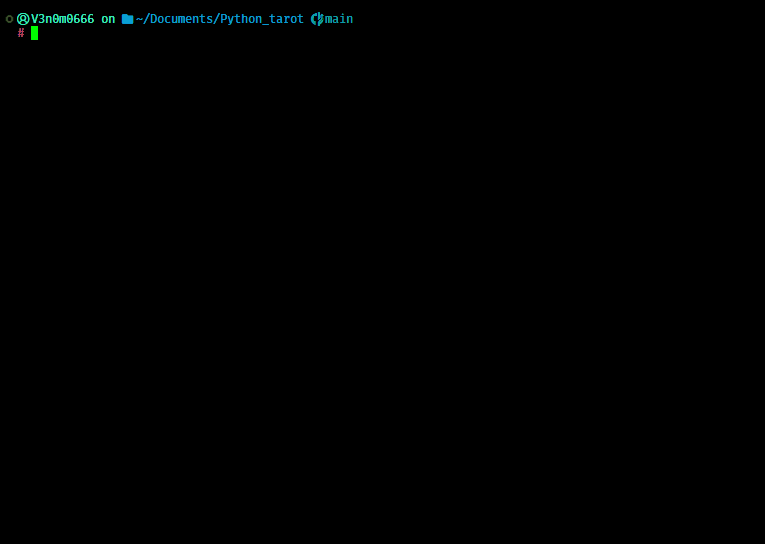
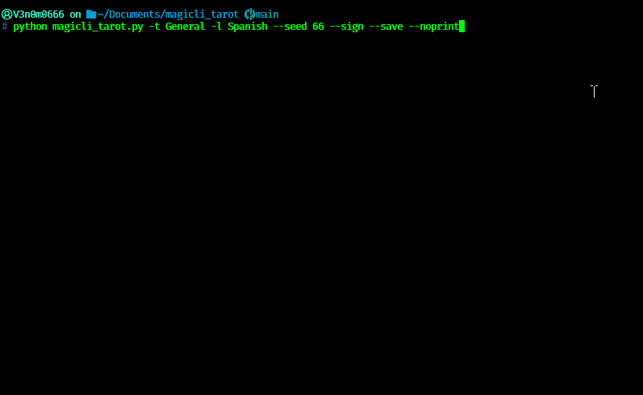
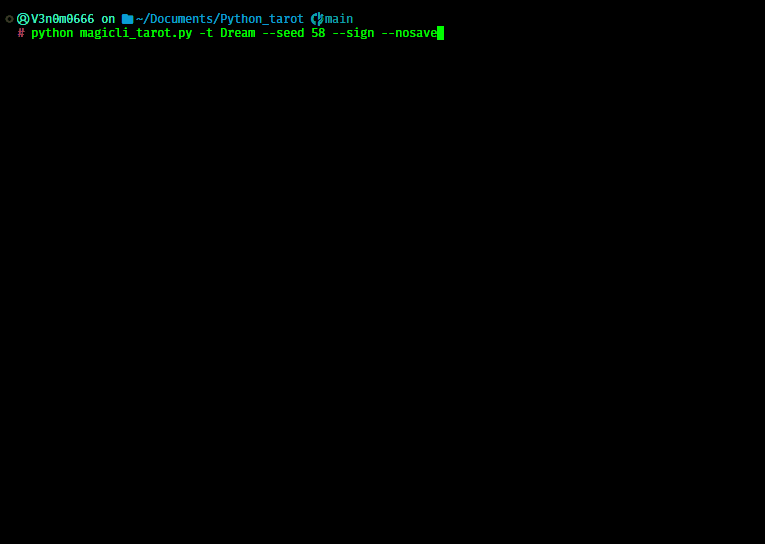

# **MAGICLI_TAROT**

```
░█▄█░█▀█░█▀▀░▀█▀░█▀▀░█░░░▀█▀░░░░░▀█▀░█▀█░█▀▄░█▀█░▀█▀
░█░█░█▀█░█░█░░█░░█░░░█░░░░█░░░░░░░█░░█▀█░█▀▄░█░█░░█░
░▀░▀░▀░▀░▀▀▀░▀▀▀░▀▀▀░▀▀▀░▀▀▀░▀▀▀░░▀░░▀░▀░▀░▀░▀▀▀░░▀░
```

#### Video Demo: <TODO>

#### Description

**MagicLI Tarot** is a command-line Python application that simulates tarot card readings using traditional tarot spreads and Google's Gemini API. The program randomly draws cards from a standard 78-card tarot deck, assigns upright or reversed orientations, and generates a detailed interpretation based on the selected spread.

Users can choose from several predefined spreads or create a custom spread, specify the output language, AI model and optionally save the reading as a Markdown file.

With the Power of **Python** and **AI**, we are bringing Tarot Readings to the comfort of your own CLI

## Features

- 78-card tarot deck
- Upright and reversed cards
- Multiple predefined tarot spreads
- Custom spreads
- AI-generated interpretations
- Multiple output languages
- Markdown export
- Interactive and command-line modes
- Reproducible readings with `--seed`
- Automated tests with pytest

## Requirements

- Python 3.13.12+
- google-genai==2.10.0
- python-dotenv==1.2.2

## Installation

Clone the repository

```bash
git clone https://github.com/venom0666/magicli_tarot.git
cd magicli_tarot
```

Install dependencies

```bash
pip install -r requirements.txt

```

## Environment Variables

- You need to generate a Free [Google AI Studio API Key](https://aistudio.google.com/)
- Create an environment variable named `GEMINI_API_KEY`.

Windows PowerShell

```powershell
$env:GEMINI_API_KEY="your_api_key"
```

Linux/macOS

```bash
export GEMINI_API_KEY="your_api_key"
```

## Usage

### Interactive mode

```bash
python magicli_tarot.py

```


### Command line

```bash
python magicli_tarot.py -t Celtic

```


#### Help

```bash
$ python magicli_tarot.py --help
```



#### (Reproducible) General spread with Spanish output signed and saved

```bash
python magicli_tarot.py -t General -l Spanish --seed 66 --sign --save
```



#### (Reproducible) Dream spread with English output, signed, not saved.

```bash
python magicli_tarot.py -t Dream --seed 58 --sign --nosave

```



## Project Structure

- magicli_tarot.py
  - Main entry point
- api.py
  - Communicates with Gemini and builds prompts.
- logic.py
  - Handles user interaction, argument parsing, random card generation, and saving readings.
- tarot.py
  - Contains the tarot deck and predefined spreads.
- constants.py
  - Contains a list of valid Gemini text models.
- test_magicli_tarot.py
  - Automated tests.
- requirements.txt
  - List of required modules

## Design Decisions

I separated the application into functions that each perform a single task. get_cards() is responsible only for drawing cards, while interpret_tarot() handles communication with the Gemini API. This separation makes the code easier to understand and test.

I used random cards and orientations to better simulate an actual tarot reading.

When implementing arguments to the project it got very complex, so after researching ways to better handle them I found `argparse` which greatly helped in dealing with multiple arguments.

I chose a dictionary to store the tarot spread types for simplicity in giving short names in arguments, and accessing values directly associated.

I used Markdown as an output format because I wanted a simple easy to read and small file size output.

Through arguments, you can get an output without having to interact with the terminal, but if any are missing except `-l` you will get a prompt.

For better testing and reproducibility I implemented a seed system for the randomness.

## Testing

The project includes automated tests using pytest.

Tests verify:

- Card drawing
- Card uniqueness
- Spread positions
- Model selection
- Random seed reproducibility

## Limitations

- The project requires an internet connection because all interpretations are
  generated using the Gemini API.

## Future Improvements

- HTML, DOC and PDF export options
- Add images with an image-generator model to exported file
- Reading history
- Self-hosted model support
- Migrate spread types to CSV
- Save new spread types
